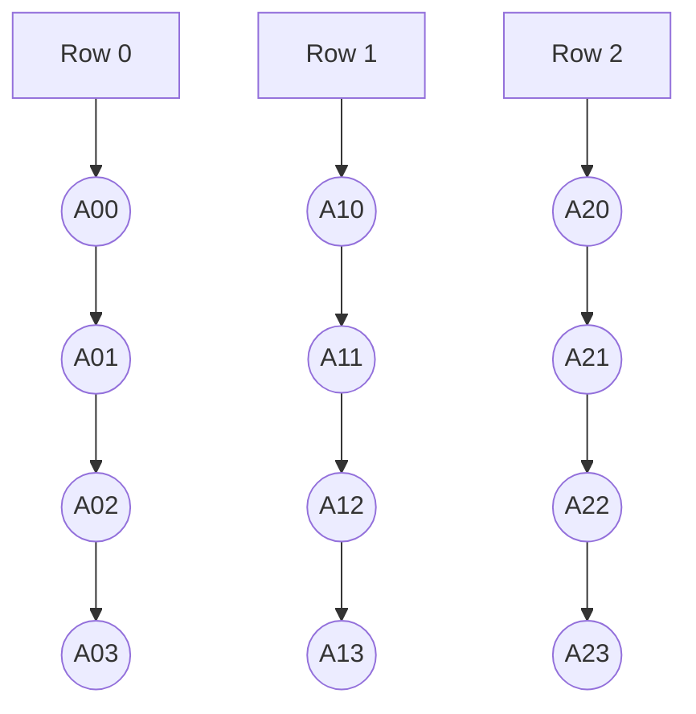
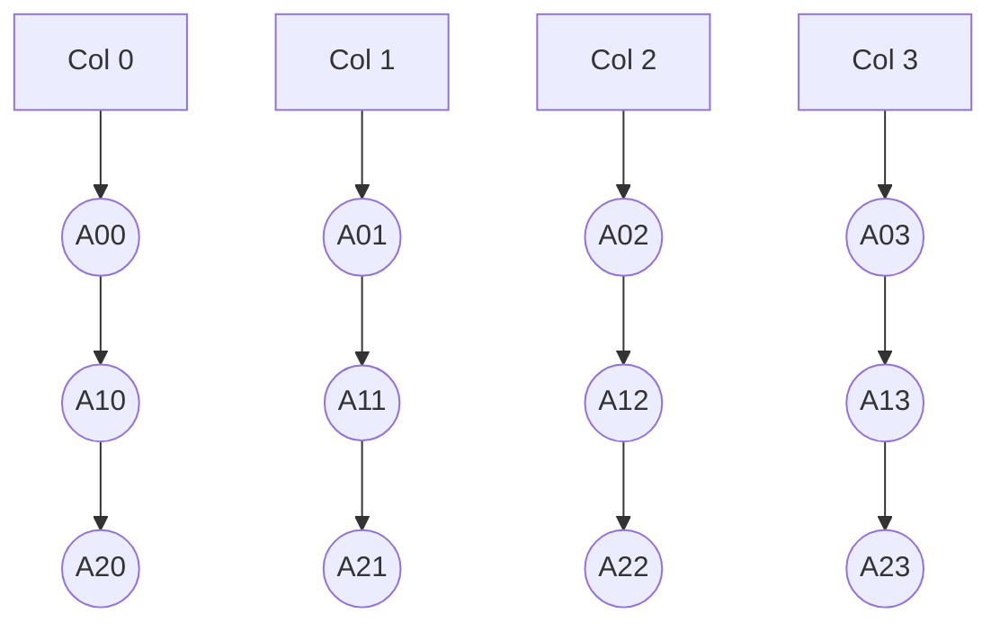

# 📘 Array Representation in Java

## 📌 Scalar Variable Representation
```java
int n = 10; // occupies 4 bytes in Java (not 2)
```

---

## 🧮 1D Array Declaration & Initialization

### Various Ways to Declare:
```java
int[] A = new int[5];                     // contains default 0s
int[] A = {2, 4, 6, 8, 10};               // full initialization
int[] A = {2, 4};                         // rest auto-filled with 0
int[] A = {0};                            // only first is 0, rest auto-filled
int[] A = {2, 4, 6, 8, 10, 12};           // size inferred as 6
```

### Access and Output:
```java
System.out.println(A[2]);
for (int i = 0; i < A.length; i++) {
    System.out.println("A[" + i + "] = " + A[i]);
}
```

---

## 🧱 Static vs Dynamic Arrays

### Static Arrays:
- Size is fixed at compile time.
```java
int[] A = new int[5];
```

### Dynamic Arrays:
- Size can be given at runtime.
```java
Scanner sc = new Scanner(System.in);
int n = sc.nextInt();
int[] A = new int[n];
```

### Simulating Array Size Increase:
```java
int[] oldArray = new int[5];
int[] newArray = new int[10];
for (int i = 0; i < oldArray.length; i++) {
    newArray[i] = oldArray[i];
}
oldArray = newArray;
```

---

## 🧮 2D Arrays in Java

### 1. Static Allocation (Stack)
Stored in stack memory.
```java
int[][] A = {
    {1, 2, 3, 4},
    {2, 4, 6, 8},
    {3, 5, 7, 9}
};
```

### 2. Array of Pointers (Heap Rows)
Each row is created separately in the heap. This allows flexibility in row size and allocation control.
```java
int[][] A = new int[3][];  // creates array of 3 references
A[0] = new int[4];         // allocate memory for row 0
A[1] = new int[4];         // allocate memory for row 1
A[2] = new int[4];         // allocate memory for row 2
```
- Useful when rows might have different lengths (jagged arrays).
- Memory for rows is allocated individually.

### 3. Fully Heap Allocated
All memory (rows and elements) is allocated in the heap in a single step.
```java
int[][] A = new int[3][4]; // 3 rows, 4 columns
```
- Most commonly used.
- Simple, uniform rectangular structure.

---

## 🧠 Address Calculation Formulas

### 1D Array:
```text
Address = Base + i * w
```
Where:
- `i` = index
- `w` = size of data type (4 bytes for int)

### 1D with index from 1:
```text
Address = Base + (i - 1) * w
```

---

## 📐 2D Array Address Formulas
Assume: `int A[3][4]`, Base address = `B`, size of int = `w`

### Row-Major (default in C/C++/Java)
```text
Address = B + ((i × totalCols) + j) × w
```
- Elements of the 2D array are stored **row-by-row** in memory.
- First complete row is stored, then second, and so on.

### Column-Major
```text
Address = B + ((j × totalRows) + i) × w
```
- Elements of the 2D array are stored **column-by-column** in memory.
- First complete column is stored, then the next column, and so on.

---

## 🔁 Row-Major and Column-Major Diagrams

### Row-Major Order
- Data is stored **horizontally** row by row in memory.


### Column-Major Order
- Data is stored **vertically** column by column in memory.


Each node like `A00`, `A11`, etc., represents a cell in the matrix `A[i][j]`. These diagrams help visualize how data is laid out in memory depending on the storage order.

---

## 🧠 n-Dimensional Array Address Formula (Row-Major)
```text
A[i1][i2][i3]...[in] = B + ((i1 × d2 × d3 × ... × dn) + (i2 × d3 × ... × dn) + ... + in) × w
```
Where:
- `B`: base address
- `w`: size of one element (in bytes)
- `d2`, `d3`, ... are dimensions sizes

---

---
# 📘 Array ADT in Java

## 📌 Abstract Data Type
An **Array** is a collection of elements stored at contiguous memory locations. It provides indexed access to elements and supports various operations such as insertion, deletion, and search.

---

## 🧠 Representation of Data
Arrays are used to represent data in a sequential format. Each element in the array can be accessed via its index.

- **Size**: Maximum number of elements an array can hold.
- **Length**: Current number of elements stored in the array.

```java
int[] A = new int[10];
int length = 6; // example length
```

---

## 🔧 Operations on Arrays

### 1. Display
Displays the elements of the array.
```java
void display(int[] A, int length) {
    for (int i = 0; i < length; i++) {
        System.out.print(A[i] + " ");
    }
}
```

### 2. Add / Append
Adds an element at the end.
```java
void append(int[] A, int n, int length) {
    A[length] = n;
    length++;
}
```

### 3. Insert
Inserts an element at a specified index.
```java
void insert(int[] A, int index, int value, int length) {
    for (int i = length; i > index; i--) {
        A[i] = A[i - 1];
    }
    A[index] = value;
    length++;
}
```

### 4. Delete
Deletes the element at a specified index.
```java
int delete(int[] A, int index, int length) {
    int deleted = A[index];
    for (int i = index; i < length - 1; i++) {
        A[i] = A[i + 1];
    }
    length--;
    return deleted;
}
```

### 5. Search

#### a. Linear Search
Performs a simple linear scan of the array to find the key.
```java
int linearSearch(int[] A, int key, int length) {
    for (int i = 0; i < length; i++) {
        if (A[i] == key) return i;
    }
    return -1;
}
```

#### b. Linear Search with Transposition
**Transposition** is an optimization technique used in linear search. When the key is found, it is swapped with its previous element. This helps frequently accessed elements gradually move toward the front of the array, improving average access time.
```java
int linearSearchTransposition(int[] A, int key, int length) {
    for (int i = 0; i < length; i++) {
        if (A[i] == key) {
            if (i > 0) {
                int temp = A[i];
                A[i] = A[i - 1];
                A[i - 1] = temp;
            }
            return i - 1;
        }
    }
    return -1;
}
```

#### c. Linear Search with Move to Head
**Move to Head** is another optimization technique where the found key is moved directly to the front (index 0). This is very effective when certain elements are searched frequently, as they will be accessed in constant time (O(1)) after the first access.
```java
int linearSearchMoveToHead(int[] A, int key, int length) {
    for (int i = 0; i < length; i++) {
        if (A[i] == key) {
            int temp = A[i];
            A[i] = A[0];
            A[0] = temp;
            return 0;
        }
    }
    return -1;
}
```

#### d. Binary Search
Requires sorted array.
```java
int binarySearch(int[] A, int key, int low, int high) {
    while (low <= high) {
        int mid = (low + high) / 2;
        if (A[mid] == key) return mid;
        else if (key < A[mid]) high = mid - 1;
        else low = mid + 1;
    }
    return -1;
}
```

---

### 6. Get and Set
Used to access or update elements at a specific index.
```java
int get(int[] A, int index) {
    return A[index];
}

void set(int[] A, int index, int value) {
    A[index] = value;
}
```

### 7. Max and Min
```java
int max(int[] A, int length) {
    int max = A[0];
    for (int i = 1; i < length; i++)
        if (A[i] > max) max = A[i];
    return max;
}

int min(int[] A, int length) {
    int min = A[0];
    for (int i = 1; i < length; i++)
        if (A[i] < min) min = A[i];
    return min;
}
```

### 8. Sum and Average
```java
int sum(int[] A, int length) {
    int total = 0;
    for (int i = 0; i < length; i++) total += A[i];
    return total;
}

float average(int[] A, int length) {
    return (float)sum(A, length) / length;
}
```

### 9. Reverse
```java
void reverse(int[] A, int length) {
    int i = 0, j = length - 1;
    while (i < j) {
        int temp = A[i];
        A[i] = A[j];
        A[j] = temp;
        i++; j--;
    }
}
```

### 10. Shift and Rotate
```java
void leftShift(int[] A, int length) {
    for (int i = 0; i < length - 1; i++) {
        A[i] = A[i + 1];
    }
    A[length - 1] = 0;
}

void leftRotate(int[] A, int length) {
    int temp = A[0];
    for (int i = 0; i < length - 1; i++) {
        A[i] = A[i + 1];
    }
    A[length - 1] = temp;
}

void rightShift(int[] A, int length) {
    for (int i = length - 1; i > 0; i--) {
        A[i] = A[i - 1];
    }
    A[0] = 0;
}

void rightRotate(int[] A, int length) {
    int temp = A[length - 1];
    for (int i = length - 1; i > 0; i--) {
        A[i] = A[i - 1];
    }
    A[0] = temp;
}
```


## 📊 Time Complexities

| Operation       | Time Complexity |
|----------------|-----------------|
| Access         | O(1)            |
| Search         | O(n) / O(log n) |
| Insertion      | O(n)            |
| Deletion       | O(n)            |
| Reverse        | O(n)            |
| Max/Min        | O(n)            |
| Shift/Rotate   | O(n)            |

---
